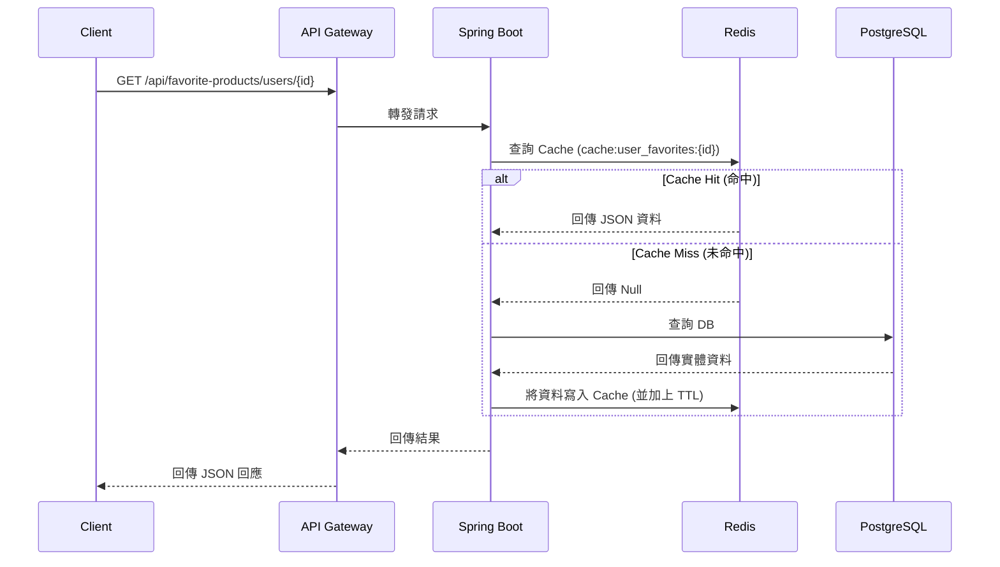

# Esun Financial System  

## 金融商品喜好紀錄系統｜玉山實作題 × 系統設計教學範例

本專案為一套金融商品喜好紀錄系統，除了提供基礎的 CRUD 功能外，更作為一個**系統設計 (System Design, SD) 的學習教材**。
專案採用前後端分離架構，並實作了多項應對高併發、資料一致性與高可用性的架構設計，包含 API Gateway 限流、Redis 快取與防雪崩機制、冪等性設計 (Idempotency) 以及 PostgreSQL 的行鎖與聚合查詢優化。

---

## 系統特色與架構亮點 (System Features)

本系統不僅僅是 Spring Boot + Vue 的簡單應用，更融合了以下業界常見的微服務與高併發架構設計：

1. **L7 負載均衡與 API 閘道器 (Kong API Gateway)**：所有外部請求先經過 Kong 進行限流 (Rate Limiting) 與 Round-robin 負載均衡，再轉發至後端多個實例。
2. **高併發讀取快取 (Redis Caching)**：使用 Redis 快取頻繁讀取的資料，大幅降低資料庫壓力。
3. **防止快取雪崩 (Cache Avalanche Prevention)**：採用「基礎時間 + 隨機時間」的 TTL 設計，避免大量快取在同一時間失效。
4. **資料庫層級的強一致性 (PostgreSQL 行鎖)**：透過 `SELECT ... FOR UPDATE` 避免 Race Condition，確保交易正確性。
5. **防止重複提交 (Idempotency 冪等性)**：利用 Redis 的 `SETNX` 機制，阻擋短時間內的重複操作。
6. **聚合查詢優化 (JSON_AGG)**：解決 ORM 常見的 N+1 Query 效能瓶頸。
7. **資料庫索引優化 (Database Indexing)**：針對常用查詢欄位與關聯欄位建立索引，大幅提升檢索速度。
8. **非同步處理與削峰填谷 (Async Processing)**：使用 Redis Queue 搭配背景 Worker 消化寫入請求，大幅提升系統瞬間吞吐量。
9. **前端樂觀更新 (Optimistic UI)**：針對非同步 API 的最終一致性 (Eventual Consistency) 問題，在前端利用假資料與輪詢確保使用者體驗無縫接軌。

---

## 系統設計 (SD) 優化解析教材

以下詳細說明本專案如何解決常見的系統設計問題，並標示了對應的程式碼位置供學習參考：

### 1. 應對高併發讀取：Redis 快取緩衝層
在高併發場景中，直接讀取資料庫會造成極大壓力。我們將使用者的最愛清單讀取加入 Redis 快取，作為資料庫前的緩衝層。當資料被更新或刪除時，我們會主動執行**快取失效 (Cache Eviction)**，以避免讀到舊資料。

**快取讀取流程圖：**


### 2. 防止快取雪崩 (Cache Avalanche)
為了解決大量快取同時過期，導致請求瞬間湧入穿透到資料庫的問題，我們在設定快取時加入了隨機過期時間 (Jitter)，將快取失效的時間點打散。

* **程式碼標記**：
  * **寫入快取與隨機 TTL**：見 `backend/src/main/java/com/esun/financialsystem/business/service/impl/FavoriteProductServiceImpl.java` 內的 `getFavoriteProductsByUser` 方法。
    ```java
    // 基礎過期時間 5 分鐘 (300秒) + 隨機 0~300 秒，防止快取雪崩
    long ttlSeconds = 300 + ThreadLocalRandom.current().nextInt(301);
    redisTemplate.opsForValue().set(cacheKey, jsonData, ttlSeconds, TimeUnit.SECONDS);
    ```
  * **快取清除 (Eviction)**：見同檔案內的 `putFavoriteProduct` 與 `deleteFavoriteProduct` 方法呼叫的 `evictUserCache(userId)`。

### 3. 避免重複提交：Redis 冪等性 (Idempotency)
當使用者因為網路延遲連續點擊新增按鈕時，系統可能會寫入重複資料。我們利用 Redis 的 `setIfAbsent` (即 SETNX) 鎖住特定請求參數 10 秒鐘。如果同一個請求在 10 秒內重複出現，系統會直接拒絕。

* **程式碼標記**：
  * **Redis 冪等性檢查**：見 `FavoriteProductServiceImpl.java` 的 `postFavoriteProduct` 方法。
    ```java
    Boolean success = redisTemplate.opsForValue().setIfAbsent(idempotencyKey, "1", Duration.ofSeconds(10));
    if (Boolean.FALSE.equals(success)) {
        throw new BadRequestException("Duplicate request, please try again later");
    }
    ```

### 4. 防止 Race Condition：DB 行鎖 (Pessimistic Lock)
在多個請求同時嘗試修改同一筆紀錄時，除了依賴前端或 Redis 的防護，我們在資料庫底層也加上了悲觀鎖 (Pessimistic Lock)。在 PostgreSQL 存儲過程中，利用 `FOR UPDATE` 鎖住關聯的 `User` 與 `Product` 資料列，確保在高併發下交易的強一致性。

* **程式碼標記**：
  * **PostgreSQL FOR UPDATE 行鎖**：見 `db/03_procedures.sql` 的 `sp_add_favorite_product` 函數。
    ```sql
    PERFORM 1 FROM "User" AS u WHERE u.user_id = p_user_id FOR UPDATE;
    ```

### 5. 資料庫查詢優化：解決 N+1 Query
查詢關聯資料時（例如查詢 User 與其下的所有 Favorite Products），若使用傳統做法會產生 1+N 次查詢。我們改為在 PostgreSQL 內直接使用 `JSON_AGG` 將多筆商品聚合成 JSON 字串回傳，大幅減少 DB 連線次數與傳輸成本。

* **程式碼標記與範例寫法**：
  * **JSON_AGG 聚合查詢**：見 `db/03_procedures.sql` 的 `sp_get_like_list` 函數。
    ```sql
    SELECT
        u.user_id,
        CAST(
            COALESCE(
                JSON_AGG(
                    JSON_BUILD_OBJECT(
                        'sn', ll.sn,
                        'productName', p.product_name,
                        'price', p.price
                    ) ORDER BY ll.sn
                ), '[]'::json
            ) AS TEXT
        ) AS favorite_products
    FROM "User" AS u
    INNER JOIN "LikeList" AS ll ON ll.user_id = u.user_id
    INNER JOIN "Product" AS p ON p.no = ll.product_no
    GROUP BY u.user_id;
    ```

### 6. 系統限流保護：API Gateway (Kong) Rate Limiting
為了防止惡意攻擊或單一使用者過度消耗系統資源，我們在 Kong API Gateway 層級加上了 Rate Limiting 插件，設定每個 IP 每分鐘最多只能請求 120 次。

* **程式碼標記與範例寫法**：
  * **限流設定**：見 `gateway/kong.yml` 中的 `plugins` 設定。
    ```yaml
    plugins:
      - name: rate-limiting
        config:
          minute: 120
          policy: local
    ```

### 7. 資料庫索引優化 (Database Indexing)
對於經常被用作 JOIN 條件、WHERE 篩選條件，或是 ORDER BY 的欄位，建立適當的索引是提升關聯式資料庫查詢效能的關鍵。我們針對外鍵 (如 `user_id`, `product_no`) 與常用搜尋欄位 (如 `email`, `product_name`) 建立了資料庫索引。

* **程式碼標記與範例寫法**：
  * **建立索引指令**：見 `db/04_indexes.sql` 檔案。
    ```sql
    -- 針對 JOIN 與查詢條件建立複合索引
    CREATE INDEX IF NOT EXISTS idx_like_list_user_id_sn
        ON "LikeList" (user_id, sn);

    -- 針對常用排序與搜尋欄位建立索引
    CREATE INDEX IF NOT EXISTS idx_product_price
        ON "Product" (price);
    ```

### 8. 非同步處理與削峰填谷 (Async Processing)
對於不需立即獲得資料庫主鍵的回應（如新增紀錄），我們將 `POST` 請求轉化為 JSON 推入 Redis List，隨即回傳受理狀態給前端。並由獨立的背景 Worker 每秒定時消化佇列，避免瞬間大量連線壓垮 PostgreSQL。

* **程式碼標記**：
  * **API 推入佇列**：見 `backend/src/main/java/com/esun/financialsystem/business/service/impl/FavoriteProductServiceImpl.java` 內的 `postFavoriteProduct` 方法。
  * **背景 Worker**：見 `backend/src/main/java/com/esun/financialsystem/business/worker/FavoriteProductWorker.java`，透過 `@Scheduled` 排程搭配 `rightPop` 消化任務。

### 9. 前端樂觀更新 (Optimistic UI) 應對最終一致性
當後端改為非同步處理時，資料寫入會產生「最終一致性 (Eventual Consistency)」的延遲。如果前端在送出表單後立刻重新拉取 API，可能會看不到最新資料。為了彌補這段時間差，我們在前端實作了樂觀更新。

* **程式碼標記與範例寫法**：
  * **Vue 樂觀更新與輪詢**：見 `frontend/src/components/FavoritePanel.vue` 的 `submitForm` 函數。
    ```javascript
    // 樂觀更新：立刻在畫面上顯示假資料（狀態顯示為處理中）
    userItem.favoriteProducts.push({ sn: Date.now(), productName: '處理中...' /* ... */ });
    
    // 輪詢：延遲刷新確保拿到 Worker 寫入後的最新 DB 資料
    setTimeout(fetchLikeList, 1200);
    setTimeout(fetchLikeList, 2500);
    ```

### 10. 大量資料分頁 (Pagination) 避免資料庫負載過大與 OOM
當系統資料量日益龐大時，若 API 查詢不加限制地撈出所有紀錄，將導致資料庫記憶體消耗過大 (OOM)、網路傳輸阻塞，甚至拖垮整個後端應用。本專案在底層存儲與 API 介面實作了嚴格的分頁機制，控制單次查詢的最大回傳筆數。

* **程式碼標記與範例寫法**：
  * **PostgreSQL LIMIT/OFFSET 分頁**：見 `db/03_procedures.sql` 的 `sp_get_like_list` 函數。
    ```sql
    -- 限制單次查詢筆數 (預設 10 筆)，並設定游標起點
    LIMIT COALESCE(NULLIF(p_page_size, 0), 10)
    OFFSET GREATEST(COALESCE(p_offset, 0), 0);
    ```
  * **總數查詢 (Total Count) 輔助**：見同檔案的 `sp_count_like_list` 函數，用於回傳符合條件的總筆數，讓前端能正確渲染分頁元件 (Pagination UI)。

---

## 系統效能壓測量化數據 (Stress Test Results)

為了具體量化上述系統設計 (SD) 優化所帶來的效能提升，我們使用 Python `aiohttp` 撰寫了壓測腳本 (`backend/stress_test.py`)，在本地環境針對核心 API 進行了高併發壓力測試。
*(壓測條件：1000 次總請求，100 個併發數 (Concurrency)，直接對口 `localhost:8081` 避開 Kong 限流)*

### 1. 讀取效能：Cache vs No-Cache

這項測試對比了「直接讓 PostgreSQL 處理複雜的 `JSON_AGG` 聚合查詢」與「直接從 Redis 讀取快取」的效能差異。

| 測試情境 | 吞吐量 (RPS) | 平均回應時間 (Latency) | P95 回應時間 |
|---------|-------------|-----------------------|-------------|
| **無快取 (PostgreSQL DB)** | ~675 req/s | 143.88 ms | 444.52 ms |
| **有快取 (Redis Cache)** | **~2586 req/s** | **36.61 ms** | **77.59 ms** |

> **結論**：Redis 快取層讓系統的**吞吐量飆升近 3.8 倍 (+283%)**，且平均回應時間**大幅降低約 74%**（從 143ms 縮短至 36ms）。在高併發場景下有效保護了 PostgreSQL 不被瞬間流量壓垮。

### 2. 寫入效能：削峰填谷 (Async Queue)

這項測試針對 `POST /api/favorite-products` 進行狂轟濫炸。為了繞過 10 秒冪等性防護，壓測腳本會隨機生成 1000 筆不同的訂單資料。

| 測試情境 | 吞吐量 (RPS) | 平均回應時間 (Latency) | P95 回應時間 |
|---------|-------------|-----------------------|-------------|
| **非同步推入佇列 (Redis Queue)** | **~1209 req/s** | **78.88 ms** | **176.29 ms** |

> **結論**：即便同時有 100 個人瘋狂點擊新增，因為 API 只負責「推入 Redis Queue 並提早回傳」，系統依然能保持高達 **1200 req/s** 的寫入吞吐量，平均回應低於 80ms。而這 1000 筆訂單會由 `backend-worker` 在背景以穩定的速率寫入資料庫，達成完美的**削峰填谷**。

---

## 專案結構

```txt
.
├── backend/               Spring Boot Maven 後端專案 (實作 Redis Cache, Idempotency)
│   ├── src/main/java/     Java 原始碼（presentation / business / data / common）
│   ├── src/main/resources/ application.yml
│   └── Dockerfile
├── db/                    PostgreSQL 建表、初始化資料、存儲程式與索引 (實作行鎖與聚合查詢)
│   ├── 01_schema.sql
│   ├── 02_seed.sql
│   ├── 03_procedures.sql
│   └── 04_indexes.sql
├── frontend/              Vue 3 + Vite 前端專案
│   ├── src/
│   │   ├── App.vue          主頁面（Tab 切換）
│   │   ├── api.js           Axios API 服務層
│   │   ├── style.css        全域設計系統
│   │   └── components/
│   │       ├── FavoritePanel.vue   喜好商品 CRUD
│   │       ├── UserPanel.vue       使用者管理 CRUD
│   │       └── ProductPanel.vue    商品管理 CRUD
│   ├── nginx.conf           Nginx 反向代理設定
│   └── Dockerfile           Multi-stage build（Node → Nginx）
├── gateway/               Kong DB-less 宣告式設定 (實作 Rate Limiting)
│   └── kong.yml
└── docker-compose.yml       多服務容器編排 (包含 Redis, Kong, DB, Backend API, Backend Worker)
```

## 系統架構

```txt
瀏覽器 → Nginx (:3000) ─┬─ /*      → Vue SPA 靜態檔案
                        └─ /api/* → Kong (:8000) → Spring Boot backend x2 (:8080) ↔ Redis Cache & Queue (:6379)
                                                                                  ↘ PostgreSQL (:5432)
                                                                                    ↑ (非同步寫入)
                                                                                    Spring Boot Worker 
```

### 技術棧

| 層級 | 技術 |
|------|------|
| 前端 | Vue 3、Vite、Axios |
| Web Server | Nginx 1.27（反向代理 + 靜態資源） |
| API Gateway | Kong Gateway（DB-less mode、L7 Round-robin、Rate Limiting） |
| 後端 | Java 17、Spring Boot 3、Spring Data Redis、Spring Web、Spring JDBC |
| 資料庫 | PostgreSQL 16 (Stored Procedure)、Redis 7 |
| 容器化 | Docker Compose |

---

## 持續整合 (Continuous Integration)

本專案配置了 GitHub Actions 作為自動化 CI 流程 (`.github/workflows/ci.yml`)，在推送 (Push) 或建立 Pull Request 至 `main` 與 `dev` 分支時會自動執行檢查，確保程式碼變更不會破壞現有功能。

CI 流程涵蓋以下三個維度的自動化檢測：

1. **後端測試 (Backend Tests)**：建置 Java 17 環境，執行 `mvn test` 確保 Spring Boot 所有單元與整合測試皆能順利通過。
2. **前端測試 (Frontend Tests)**：建置 Node 22 環境，執行 `npm run test` 進行前端測試，並執行 `npm run build` 確保 Vue 3 專案可成功編譯。
3. **基礎設施檢查 (Docker Compose Config)**：驗證 `docker-compose.yml` 配置檔的語法與結構是否正確，確保容器編排無誤。

---

## 開發與啟動方式

### 方式一：Docker Compose 全套啟動（推薦）

一鍵啟動 PostgreSQL + Redis + 兩個 Spring Boot backend + Kong + Nginx 前端：

```sh
docker compose up -d --build
```

啟動後存取：

| 服務 | 網址 |
|------|------|
| 前端（Nginx） | http://localhost:3000 |
| Kong API Gateway | http://localhost:8000 |
| 後端 API（直接） | http://localhost:8081 |
| PostgreSQL | localhost:5432 |
| Redis | localhost:6380 |

### 方式二：本機開發模式

適合前端開發時使用，Vite Dev Server 提供 HMR 熱更新：

```sh
# 1. 啟動基礎設施
docker compose up -d postgres redis backend kong

# 2. 啟動前端 dev server（Vite proxy 自動轉發 /api → localhost:8000）
cd frontend
npm install
npm run dev
```

前端 dev server：http://localhost:5173

---

## API 快速導覽

API Gateway 預設 Base URL：`http://localhost:8000`

### Favorite Product（收藏商品）API
*(本區塊 API 已受 Redis 快取與冪等性防護)*

- `GET /api/favorite-products/like-list`
- `POST /api/favorite-products` *(具備 10 秒冪等性阻擋與非同步 Message Queue 寫入)*
- `GET /api/favorite-products/users/{userId}` *(具備 Redis 讀取快取與防雪崩)*
- `PUT /api/favorite-products/{sn}` *(更新後會主動 Evict 舊快取)*
- `DELETE /api/favorite-products/{sn}` *(刪除後會主動 Evict 舊快取)*

### User API

- `GET /api/users`
- `GET /api/users/{userId}`
- `POST /api/users`
- `PUT /api/users/{userId}`
- `DELETE /api/users/{userId}`

### Product API

- `GET /api/products`
- `GET /api/products/{no}`
- `POST /api/products`
- `PUT /api/products/{no}`
- `DELETE /api/products/{no}`

---
*此專案除了滿足基礎商業需求外，更適合作為進階系統設計的參考範例。歡迎查閱各模組原始碼，深入了解實作細節！*
