# Esun Financial System

## 金融商品喜好紀錄系統｜銀行高流量場景 × 系統設計教學範例

## 交付重點

本專案可直接以 Docker Compose 啟動完整三層式系統：

```sh
docker compose up -d --build
```

啟動後可從以下入口檢查：

| 項目 | 入口 |
|---|---|
| 前端介面 | http://localhost:3000 |
| API Gateway | http://localhost:8000 |
| Backend Health Check | http://localhost:8000/actuator/health |
| Like List API | http://localhost:8000/api/favorite-products/like-list |

題目要求對照：

| 要求 | 對應實作 |
|---|---|
| Vue.js 前端 | `frontend/src`，提供使用者、商品、喜好清單操作介面 |
| Spring Boot RESTful API | `backend/src/main/java/com/esun/financialsystem/presentation/controller` |
| Maven 專案 | `backend/pom.xml`，Java 17 / Spring Boot 3 |
| 三層式架構 | Nginx Web Server + Spring Boot Application Server + PostgreSQL |
| 後端分層 | `presentation`、`business`、`data`、`common` |
| Stored Procedure 存取 DB | `db/03_procedures.sql`；User、Product、FavoriteProduct Repository 皆透過 `SELECT sp_*` 呼叫 |
| Transaction | Service `@Transactional` 搭配 Stored Procedure 內 `FOR UPDATE` |
| DDL / DML | `db/01_schema.sql`、`db/02_seed.sql`、`db/03_procedures.sql`、`db/04_indexes.sql` |
| SQL Injection 防護 | JDBC placeholder、Stored Procedure 參數化、排序欄位白名單 |
| XSS 防護 | Vue template binding 預設 escape，不使用 `v-html` |

樣本資料已內建於 `db/02_seed.sql`，包含 10 筆使用者、10 筆金融商品與 18 筆喜好清單，可直接展示搜尋、排序、分頁與金額計算。

---

## 專案情境

在銀行與金融服務場景中，系統通常需要同時面對大量使用者查詢、短時間內重複提交、資料一致性要求、API 流量控管，以及後續維護與擴充需求。

例如，當使用者查詢自己的金融商品喜好清單時，系統可能會在短時間內收到大量讀取請求；當使用者新增或修改喜好金融商品時，系統也必須避免重複提交、資料錯亂或交易不一致。除此之外，金融系統也需要考量 SQL Injection、XSS、Rate Limiting、Transaction、資料庫效能、CI 自動化檢查與系統可維護性等工程議題。

因此，本專案不只完成一套金融商品喜好紀錄系統，也將它延伸為一個後端工程與系統設計學習範例，目標是打造一套具備以下特性的系統：

- **安全性**：避免 SQL Injection、XSS、惡意高頻請求與重複提交。
- **可靠性**：透過 Transaction、Row Lock、Idempotency 確保資料一致性。
- **高效能**：透過 Redis Cache、資料庫索引、JSON_AGG 聚合查詢降低查詢成本。
- **高可用性**：透過 API Gateway、Rate Limiting、多後端實例與非同步處理提升系統承載能力。
- **可維護性**：採用清楚的分層架構、Docker Compose、GitHub Actions CI 與模組化設計。
- **可擴充性**：保留後續導入 Kubernetes、Observability、Message Queue、分散式追蹤的擴充空間。

---

## 專案簡介

本專案為一套金融商品喜好紀錄系統，使用者可以透過前端介面新增、查詢、修改與刪除自己偏好的金融商品，並由系統計算預計扣款總金額與總手續費用。

本系統以玉山銀行後端工程師 Java 實作題為基礎，依照題目要求完成：

- Vue.js 前端
- Spring Boot 後端
- RESTful API
- Maven 專案
- Stored Procedure
- Transaction
- SQL Injection 防護
- XSS 防護
- Web Server + Application Server + 關聯式資料庫的三層式架構
- 展示層、業務層、資料層、共用層的後端分層設計

在完成基本功能後，本專案進一步加入多項常見的系統設計優化：

- Kong API Gateway：統一 API 入口、限流與負載均衡
- Redis Cache：降低高併發讀取對資料庫造成的壓力
- Cache Avalanche Prevention：使用 TTL Jitter 避免快取同時失效
- Idempotency：使用 Redis SETNX 避免短時間重複提交
- PostgreSQL Row Lock：使用 `SELECT ... FOR UPDATE` 避免 Race Condition
- JSON_AGG：減少 N+1 Query 與後端資料組裝成本
- Database Indexing：針對查詢、JOIN、排序欄位建立索引
- Async Queue：使用 Redis Queue + Worker 削峰填谷
- Optimistic UI：改善非同步寫入下的使用者體驗
- Pagination：避免大量資料一次查詢造成 DB 與後端負載過高
- GitHub Actions CI：自動執行後端測試、前端建置與 Docker Compose 檢查

---

## 目前完成狀態檢查

| 類別 | 狀態 | 實作位置 |
|---|---|---|
| 題目核心 CRUD | 已完成 | `frontend/src/components/*Panel.vue`、`backend/src/main/java/com/esun/financialsystem/presentation/controller` |
| 後端分層 | 已完成 | `presentation`、`business`、`data`、`common` |
| JDBC 呼叫 Stored Procedure | 已完成 | `data/repository/impl/*JdbcRepository.java`、`data/sql/*Sql.java` |
| Stored Procedure | 已完成 | `db/03_procedures.sql`，User / Product / FavoriteProduct DB 存取皆透過 `sp_*` |
| Transaction / Row Lock | 已完成 | Service `@Transactional`、Stored Procedure `FOR UPDATE` |
| SQL Injection 防護 | 已完成 | JDBC placeholder、排序欄位白名單、Stored Procedure 參數化 |
| XSS 防護 | 已完成 | Vue template binding 預設 escape，不使用 `v-html` |
| JSON_AGG 查詢優化 | 已完成 | `sp_get_like_list` 使用 `JSON_AGG` / `JSON_BUILD_OBJECT` |
| DB Index | 已完成 | `db/04_indexes.sql` |
| Redis Cache | 已完成 | `FavoriteProductServiceImpl#getFavoriteProductsByUser` |
| TTL Jitter | 已完成 | cache TTL 使用 300 秒 + 隨機 0 至 300 秒 |
| Cache Eviction | 已完成 | 新增排隊前、Worker 寫入後、PUT/DELETE 成功後清除使用者 cache |
| Idempotency Key | 已完成 | 前端 Axios 加 `Idempotency-Key`，後端用 Redis `SETNX` 判斷重複 |
| Async Queue / Worker | 已完成 | Redis List `queue:favorite_products`、`business/worker/FavoriteProductWorker.java` |
| Kong API Gateway | 已完成 | `gateway/kong.yml`、`docker-compose.yml` |
| L7 Load Balancing | 已完成 | Kong upstream round-robin 到 `backend` / `backend-replica` |
| Rate Limiting | 已完成 | Kong `rate-limiting` plugin，預設每分鐘 120 次 |
| 前後端測試與 CI | 已完成 | `backend/src/test`、`frontend/src/*.test.js`、`.github/workflows/ci.yml` |

尚未納入 production 等級治理的項目包含：Redis Queue retry / dead-letter queue、Idempotency response snapshot replay、集中式 log、metrics dashboard、distributed tracing、Kubernetes 部署。這些項目 README 會定位為後續擴充，不列為目前已完成。

---

## 最後驗證結果

本次檢查已完成以下驗證：

| 驗證項目 | 結果 |
|---|---|
| Docker Compose 設定檢查 | `docker compose config --quiet` 通過 |
| Backend 測試 | Docker Maven 執行 `mvn test` 通過，19 tests passed |
| Frontend 測試 | `npm run test` 通過，5 tests passed |
| Frontend Build | `npm run build` 通過 |
| Compose 實際啟動 | `docker compose up -d --build` 通過 |
| Gateway Health Check | `GET /actuator/health` 回傳 200 |
| Favorite List API | `GET /api/favorite-products/like-list` 回傳 200 |
| Async POST | `POST /api/favorite-products` 回傳 202 Accepted |
| Idempotency 重複提交 | 相同 `Idempotency-Key` 第二次送出回傳 400 |
| Worker Queue 消化 | Redis `LLEN queue:favorite_products` 回到 0 |
| Kong Rate Limiting | Response header 回傳 `X-RateLimit-Limit-Minute: 120` |

---

## 系統設計目標

本專案的設計目標不是單純完成 CRUD，而是模擬銀行系統在真實服務中可能遇到的工程問題，並以可學習、可觀察、可測試的方式實作對應解法。

| 系統問題 | 對應設計 |
|---|---|
| 大量使用者同時查詢喜好商品 | Redis Cache |
| 大量快取同時過期導致 DB 瞬間壓力過高 | TTL Jitter 防止 Cache Avalanche |
| 使用者連續點擊造成重複新增 | Redis SETNX Idempotency |
| 多請求同時異動同一筆資料 | PostgreSQL Transaction + Row Lock |
| ORM 查詢造成 N+1 Query | PostgreSQL JSON_AGG 聚合查詢 |
| 單一 IP 或惡意請求過度消耗資源 | Kong Rate Limiting |
| 寫入流量瞬間暴增 | Redis Queue + Background Worker |
| 非同步寫入導致前端短暫查不到資料 | Optimistic UI + Polling |
| 查詢資料量過大造成 DB / API 負載過高 | Pagination |
| 程式碼修改後破壞既有功能 | GitHub Actions CI |

---

## 系統特色與架構亮點

### 1. 銀行場景導向的三層式架構

本系統符合 Web Server、Application Server、Database 的三層式架構設計。前端由 Vue 3 建立使用者操作介面，Nginx 負責靜態資源與反向代理，Kong 作為 API Gateway，Spring Boot 負責商業邏輯與資料處理，PostgreSQL 作為主要關聯式資料庫，Redis 則負責快取、冪等性與非同步佇列。

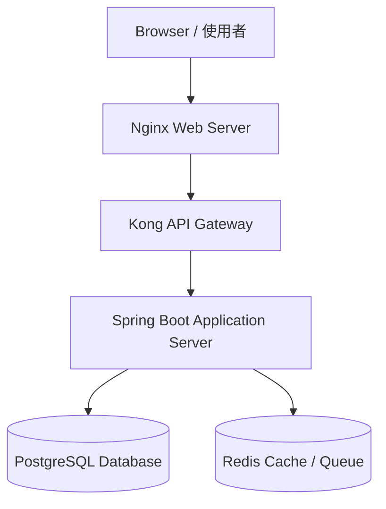
```mermaid
flowchart TD
    Client[Browser / 使用者] --> Web[Nginx Web Server]
    Web --> Gateway[Kong API Gateway]
    Gateway --> App[Spring Boot Application Server]
    App --> DB[(PostgreSQL Database)]
    App --> Redis[(Redis Cache / Queue)]
```

### 設計重點

| 層級 | 元件 | 職責 |
|---|---|---|
| Web Server | Nginx | 提供 Vue 靜態檔案，並將 API 請求反向代理至 Kong |
| API Gateway | Kong | 統一 API 入口、限流、負載均衡 |
| Application Server | Spring Boot | 處理商業邏輯、資料驗證、快取、Queue、DB 存取 |
| Database | PostgreSQL | 儲存核心資料，透過 Stored Procedure 與 Transaction 確保一致性 |
| Cache / Queue | Redis | 快取查詢結果、處理冪等性、暫存寫入任務 |

---

### 2. 清楚的後端分層設計

後端依照題目要求拆分為展示層、業務層、資料層與共用層，降低 Controller、Service 與 Repository 之間的耦合，使系統更容易維護、測試與擴充。

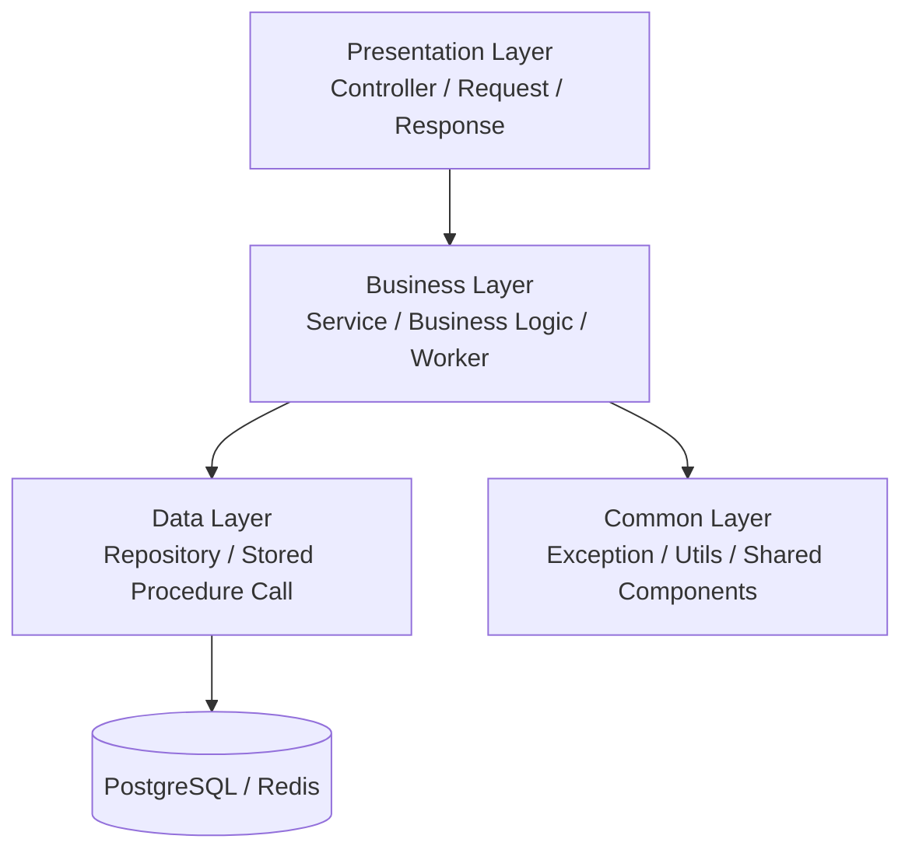
```mermaid
flowchart TD
    Controller[Presentation Layer<br/>Controller / Request / Response]
    Service[Business Layer<br/>Service / Business Logic / Worker]
    Repository[Data Layer<br/>Repository / Stored Procedure Call]
    Common[Common Layer<br/>Exception / Utils / Shared Components]
    Database[(PostgreSQL / Redis)]

    Controller --> Service
    Service --> Repository
    Service --> Common
    Repository --> Database
```

| 層級 | 對應 Package | 職責 |
|---|---|---|
| 展示層 Presentation | `presentation` | Controller、Request、Response、API 入口 |
| 業務層 Business | `business` | Service、商業邏輯、快取、冪等性、Queue |
| 資料層 Data | `data` | Repository、Stored Procedure 呼叫、資料存取 |
| 共用層 Common | `common` | Exception、錯誤處理、共用工具 |

---

### 3. 高併發讀取保護

金融系統常見的查詢操作，例如使用者查看商品清單、帳戶資訊或交易紀錄，通常會遠多於寫入操作。

因此本系統對使用者喜好商品查詢加入 Redis Cache。讀取時先查 Redis，如果快取命中就直接回傳；如果快取未命中，才查 PostgreSQL 並將結果回填 Redis。

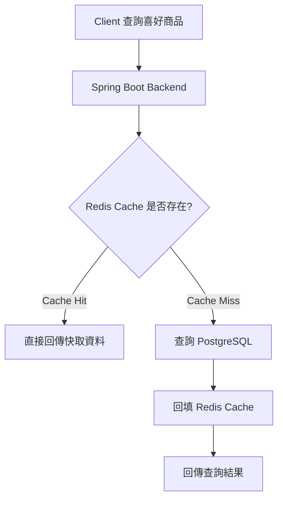
```mermaid
flowchart TD
    A[Client 查詢喜好商品] --> B[Spring Boot Backend]
    B --> C{Redis Cache 是否存在?}
    C -->|Cache Hit| D[直接回傳快取資料]
    C -->|Cache Miss| E[查詢 PostgreSQL]
    E --> F[回填 Redis Cache]
    F --> G[回傳查詢結果]
```

此設計可以大幅降低 PostgreSQL 在高併發讀取時的壓力。

---

### 4. 資料一致性與交易安全

金融系統不能只追求快，也必須確保資料正確。

本專案在新增、修改、刪除喜好商品時，使用 Stored Procedure 與 Transaction 處理多表異動，並在必要情境使用 PostgreSQL `FOR UPDATE` 鎖住資料列，避免多個請求同時修改同一筆資料造成 Race Condition。

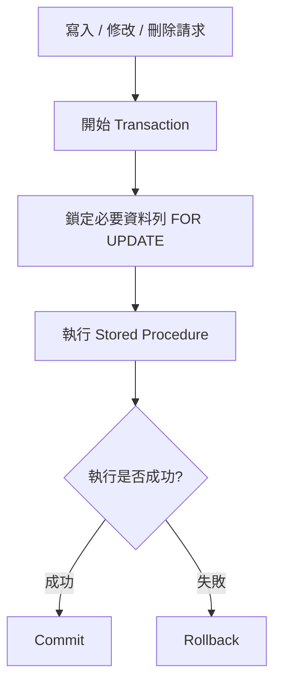
```mermaid
flowchart TD
    A[寫入 / 修改 / 刪除請求] --> B[開始 Transaction]
    B --> C[鎖定必要資料列 FOR UPDATE]
    C --> D[執行 Stored Procedure]
    D --> E{執行是否成功?}
    E -->|成功| F[Commit]
    E -->|失敗| G[Rollback]
```

---

### 5. 防止重複提交

使用者可能因為網路延遲、連續點擊或重送請求，導致同一筆新增操作被送出多次。

本系統使用 Redis `SETNX` 建立短時間的 Idempotency Key。若同一個請求在 10 秒內重複出現，Redis 會拒絕第二次寫入，後端就可以判斷這是一筆重複請求。

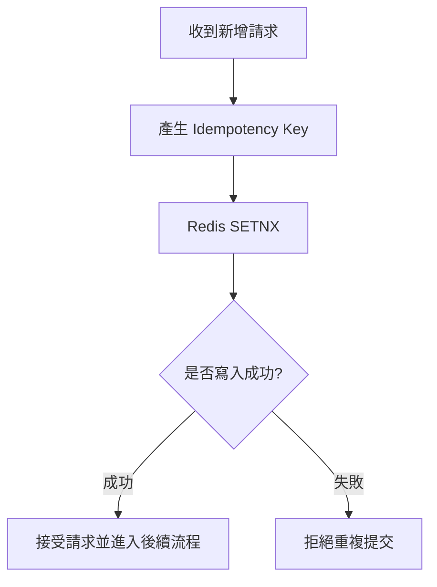
```mermaid
flowchart TD
    A[收到新增請求] --> B[產生 Idempotency Key]
    B --> C[Redis SETNX]
    C --> D{是否寫入成功?}
    D -->|成功| E[接受請求並進入後續流程]
    D -->|失敗| F[拒絕重複提交]
```

---

### 6. API Gateway 流量控管

所有外部 API 請求都會先經過 Kong API Gateway。Kong 負責統一 API 入口、Rate Limiting、L7 Routing、Round-robin Load Balancing，並在進入應用層之前先做第一層流量保護。

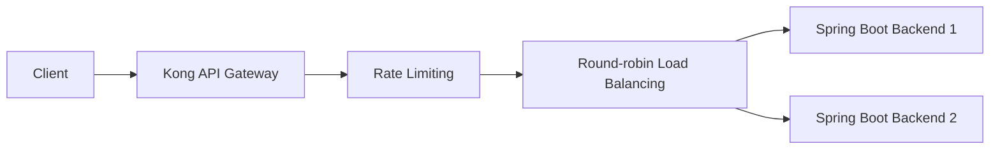
```mermaid
flowchart LR
    Client[Client] --> Kong[Kong API Gateway]
    Kong --> RateLimit[Rate Limiting]
    RateLimit --> LB[Round-robin Load Balancing]
    LB --> Backend1[Spring Boot Backend 1]
    LB --> Backend2[Spring Boot Backend 2]
```

此設計可避免所有請求直接打到 Spring Boot 後端，降低單一服務被大量請求壓垮的風險。

---

### 7. 非同步寫入與削峰填谷

在高併發寫入場景中，如果每個 API 請求都直接寫入 DB，資料庫可能會在短時間內承受大量 transaction。

因此本系統將新增喜好商品流程設計為 API 先接收請求，通過檢查後推入 Redis Queue，並立即回傳 Accepted。真正的 DB 寫入由 Worker 背景處理。

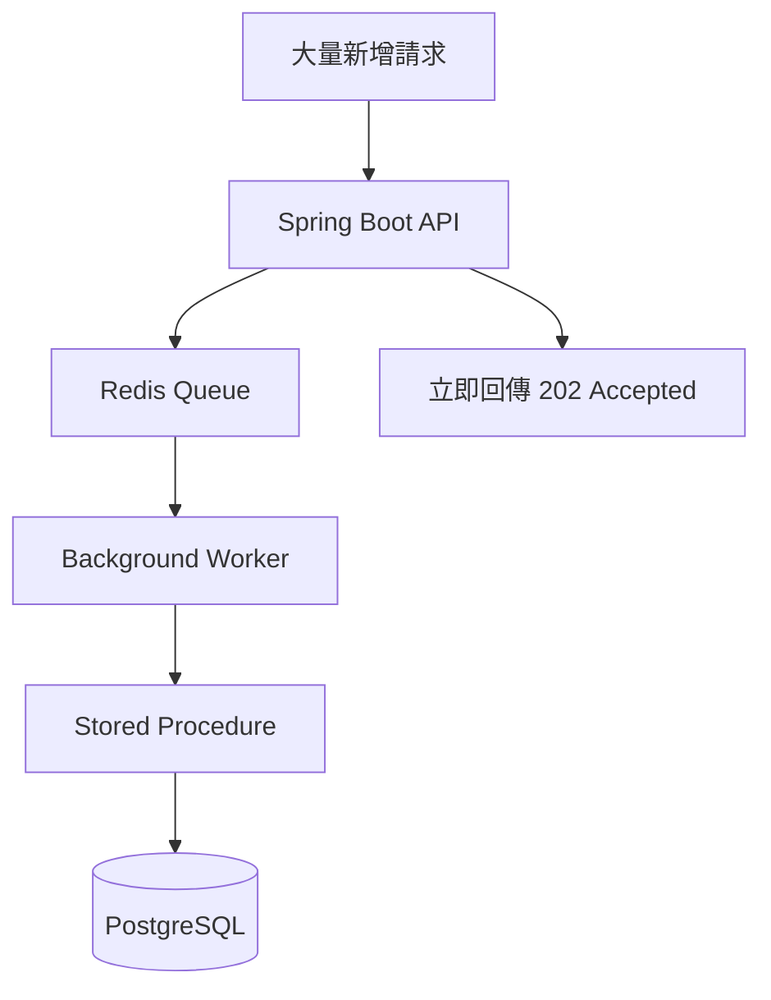
```mermaid
flowchart TD
    A[大量新增請求] --> B[Spring Boot API]
    B --> C[Redis Queue]
    B --> D[立即回傳 202 Accepted]
    C --> E[Background Worker]
    E --> F[Stored Procedure]
    F --> G[(PostgreSQL)]
```

這種設計讓 API 層快速回應，真正的 DB 寫入由 Worker 以穩定速度處理，降低資料庫瞬間壓力。

---

## 整體系統架構圖

本系統採用前後端分離與三層式架構，並在傳統 Web Server、Application Server、Database 架構之上，額外加入 API Gateway、Redis 與 Background Worker。

這張圖主要說明一個使用者請求從瀏覽器進入系統後，會經過哪些元件，以及每個元件在系統中扮演什麼角色。

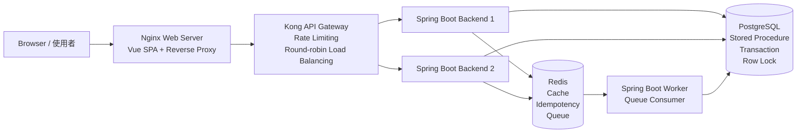
```mermaid
flowchart LR
    Client[Browser / 使用者] --> Nginx[Nginx Web Server<br/>Vue SPA + Reverse Proxy]

    Nginx --> Kong[Kong API Gateway<br/>Rate Limiting<br/>Round-robin Load Balancing]

    Kong --> Backend1[Spring Boot Backend 1]
    Kong --> Backend2[Spring Boot Backend 2]

    Backend1 --> Redis[(Redis<br/>Cache<br/>Idempotency<br/>Queue)]
    Backend2 --> Redis

    Backend1 --> DB[(PostgreSQL<br/>Stored Procedure<br/>Transaction<br/>Row Lock)]
    Backend2 --> DB

    Redis --> Worker[Spring Boot Worker<br/>Queue Consumer]
    Worker --> DB
```

### 架構設計重點

| 元件 | 職責 | 設計目的 |
|---|---|---|
| Browser | 使用者操作介面 | 提供金融商品喜好清單的新增、查詢、修改、刪除 |
| Nginx | Web Server / Reverse Proxy | 提供 Vue 靜態檔案，並將 API 請求轉送至 Gateway |
| Kong API Gateway | API Gateway | 統一 API 入口、限流、負載均衡，避免請求直接打到後端 |
| Spring Boot Backend | Application Server | 處理商業邏輯、資料驗證、快取、冪等性與 DB 存取 |
| Redis | Cache / Queue / Idempotency | 降低 DB 壓力、避免重複提交、暫存高峰寫入任務 |
| PostgreSQL | Relational Database | 儲存核心資料，透過 Stored Procedure 與 Transaction 確保一致性 |
| Background Worker | Queue Consumer | 背景消化 Redis Queue，將寫入流量平滑送入 DB |

---

## 核心請求流程

### 查詢喜好商品：Cache Aside Pattern

在金融系統中，查詢類操作通常會遠多於寫入操作。例如使用者可能頻繁查看自己的金融商品喜好清單，如果每次查詢都直接進入 PostgreSQL，資料庫會承受大量重複讀取壓力。

因此本系統在查詢使用者喜好商品時採用 Cache Aside Pattern。後端會先查 Redis，若 Redis 已有資料，代表 Cache Hit，可直接回傳；若 Redis 沒有資料，才會查詢 PostgreSQL，並將查詢結果回填到 Redis，供後續請求使用。

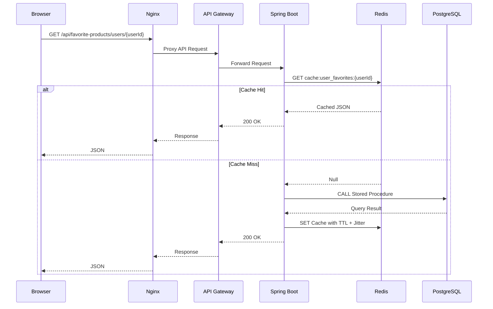
```mermaid
sequenceDiagram
    participant Client as Browser
    participant Nginx
    participant Kong as API Gateway
    participant Backend as Spring Boot
    participant Redis
    participant DB as PostgreSQL

    Client->>Nginx: GET /api/favorite-products/users/{userId}
    Nginx->>Kong: Proxy API Request
    Kong->>Backend: Forward Request
    Backend->>Redis: GET cache:user_favorites:{userId}

    alt Cache Hit
        Redis-->>Backend: Cached JSON
        Backend-->>Kong: 200 OK
        Kong-->>Nginx: Response
        Nginx-->>Client: JSON
    else Cache Miss
        Redis-->>Backend: Null
        Backend->>DB: CALL Stored Procedure
        DB-->>Backend: Query Result
        Backend->>Redis: SET Cache with TTL + Jitter
        Backend-->>Kong: 200 OK
        Kong-->>Nginx: Response
        Nginx-->>Client: JSON
    end
```

### 流程說明

| 步驟 | 說明 |
|---|---|
| 1 | 使用者從前端送出查詢喜好商品請求 |
| 2 | Nginx 將 `/api/*` 請求轉發給 Kong |
| 3 | Kong 進行限流與負載均衡後，轉發至 Spring Boot Backend |
| 4 | Backend 先查 Redis 是否已有該使用者的喜好商品快取 |
| 5 | 若 Cache Hit，直接回傳 Redis 中的 JSON 資料 |
| 6 | 若 Cache Miss，Backend 呼叫 PostgreSQL Stored Procedure 查詢資料 |
| 7 | DB 回傳結果後，Backend 將資料寫入 Redis 並設定 TTL + Jitter |
| 8 | Backend 將結果回傳給前端 |

### 設計重點

- Redis 作為 DB 前方的快取層，可以減少重複查詢。
- Cache Miss 時才查詢 PostgreSQL，可以降低 DB 負載。
- 寫入 Redis 時加入 TTL + Jitter，可以避免大量快取同時失效。
- 修改或刪除資料後會主動清除快取，避免使用者讀到舊資料。

---

### 新增喜好商品：Idempotency + Async Queue

新增喜好商品屬於寫入操作，寫入操作比查詢更需要注意資料一致性與重複提交問題。

在實際金融系統中，使用者可能因為網路延遲、按鈕連點、瀏覽器重送請求，導致同一筆新增操作被送出多次。如果後端沒有防護，就可能產生重複資料。

另一方面，若大量使用者在短時間內同時新增資料，每個 API request 都直接寫入 PostgreSQL，也可能造成資料庫連線與 Transaction 壓力暴增。

因此本系統將新增流程拆成兩層保護：

1. Idempotency：使用 Redis `SETNX` 避免短時間重複提交。
2. Async Queue：通過檢查後先推入 Redis Queue，由 Worker 背景寫入 DB。

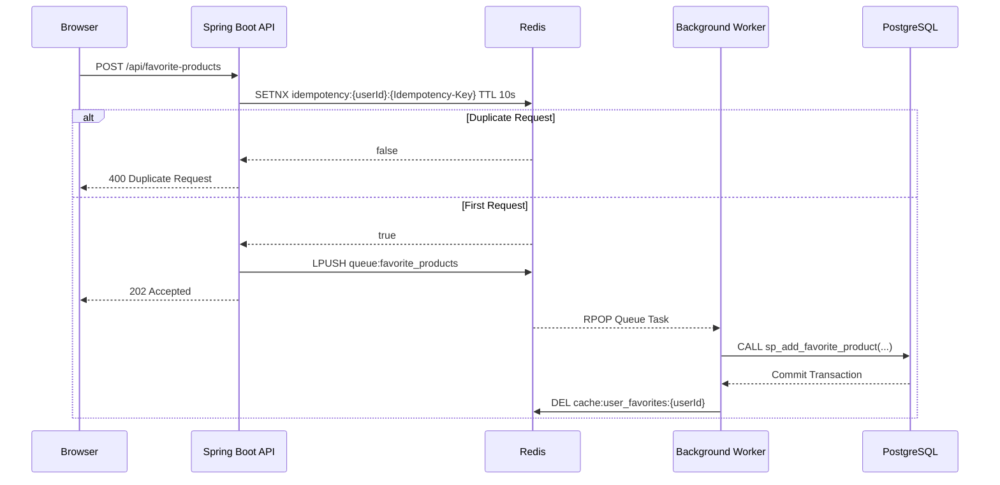
```mermaid
sequenceDiagram
    participant Client as Browser
    participant Backend as Spring Boot API
    participant Redis
    participant Worker as Background Worker
    participant DB as PostgreSQL

    Client->>Backend: POST /api/favorite-products
    Backend->>Redis: SETNX idempotency:{userId}:{Idempotency-Key} TTL 10s

    alt Duplicate Request
        Redis-->>Backend: false
        Backend-->>Client: 400 Duplicate Request
    else First Request
        Redis-->>Backend: true
        Backend->>Redis: LPUSH queue:favorite_products
        Backend-->>Client: 202 Accepted

        Redis-->>Worker: RPOP Queue Task
        Worker->>DB: CALL sp_add_favorite_product(...)
        DB-->>Worker: Commit Transaction
        Worker->>Redis: DEL cache:user_favorites:{userId}
    end
```

### 流程說明

| 步驟 | 說明 |
|---|---|
| 1 | 使用者送出新增喜好商品請求 |
| 2 | Backend 優先使用前端送出的 `Idempotency-Key`，若未提供才用 request 內容產生 fallback key |
| 3 | Backend 使用 Redis `SETNX` 檢查是否為短時間重複提交 |
| 4 | 若 Redis 回傳 false，代表已有相同請求正在處理或剛處理過，直接拒絕 |
| 5 | 若 Redis 回傳 true，代表此請求可被接受 |
| 6 | Backend 將請求資料推入 Redis Queue |
| 7 | API 先回傳 `202 Accepted`，避免使用者等待 DB 寫入完成 |
| 8 | Worker 從 Redis Queue 取出任務 |
| 9 | Worker 呼叫 PostgreSQL Stored Procedure 寫入資料 |
| 10 | 寫入成功後清除該使用者相關 Cache，避免後續查詢讀到舊資料 |

### 設計重點

- `SETNX` 可以避免短時間重複提交。
- Redis Queue 可以吸收瞬間寫入流量。
- Worker 背景處理可以降低 API response time。
- DB 寫入仍由 Stored Procedure 與 Transaction 保證資料一致性。
- 寫入成功後清除 cache，確保後續查詢會重新取得最新資料。

---

### 修改 / 刪除喜好商品：Transaction + Cache Eviction

修改與刪除屬於會影響既有資料的操作，因此系統需要確保 DB 異動成功後，使用者下次查詢不能再讀到舊的 Redis Cache。

本流程的重點是先完成資料庫交易，再進行 cache eviction。若 DB 更新失敗，transaction 會 rollback，不會清除 cache；若 DB 更新成功，才清除該使用者相關快取。

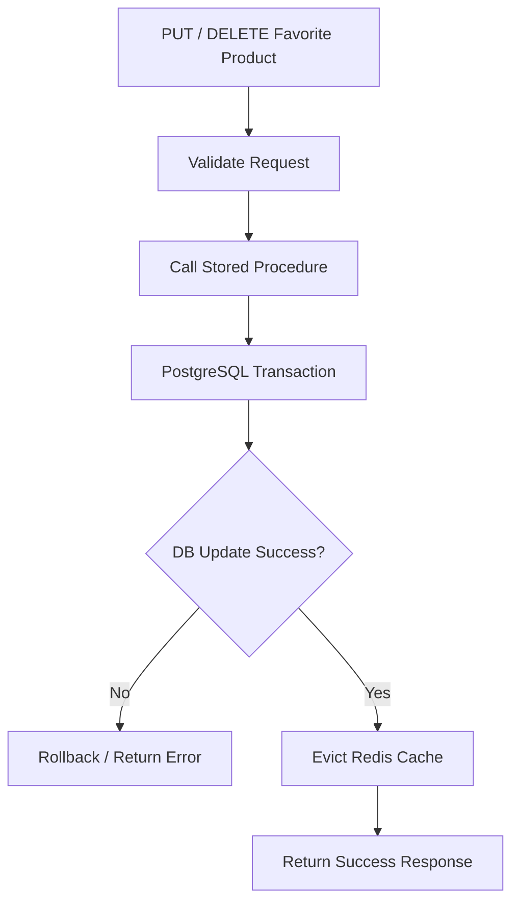
```mermaid
flowchart TD
    A[PUT / DELETE Favorite Product] --> B[Validate Request]
    B --> C[Call Stored Procedure]
    C --> D[PostgreSQL Transaction]
    D --> E{DB Update Success?}
    E -->|No| F[Rollback / Return Error]
    E -->|Yes| G[Evict Redis Cache]
    G --> H[Return Success Response]
```

### 流程說明

| 步驟 | 說明 |
|---|---|
| 1 | 使用者送出修改或刪除請求 |
| 2 | Backend 驗證 request 格式與必要欄位 |
| 3 | Backend 呼叫 Stored Procedure |
| 4 | PostgreSQL 在 Transaction 中執行資料異動 |
| 5 | 若發生錯誤則 rollback，回傳錯誤 |
| 6 | 若異動成功則 commit |
| 7 | Backend 清除該使用者的 Redis Cache |
| 8 | 回傳成功結果給前端 |

### 設計重點

- DB transaction 是資料正確性的核心。
- Cache eviction 必須在 DB 更新成功後才執行。
- 若先清 cache 但 DB 更新失敗，可能造成不必要的 cache miss。
- 若 DB 成功但不清 cache，使用者可能會讀到舊資料。

---

## 系統設計優化解析教材

以下章節說明本專案如何解決常見的後端與系統設計問題，並標示對應的程式碼位置。

---

### 1. 高併發讀取：Redis Cache

在高併發場景下，若所有查詢都直接進 PostgreSQL，資料庫會承受大量讀取壓力。

本系統使用 Redis 作為資料庫前方的快取緩衝層。當使用者查詢喜好商品時，後端會先查 Redis；若 Redis 有資料，直接回傳；若沒有資料，才查 PostgreSQL 並將結果寫回 Redis。

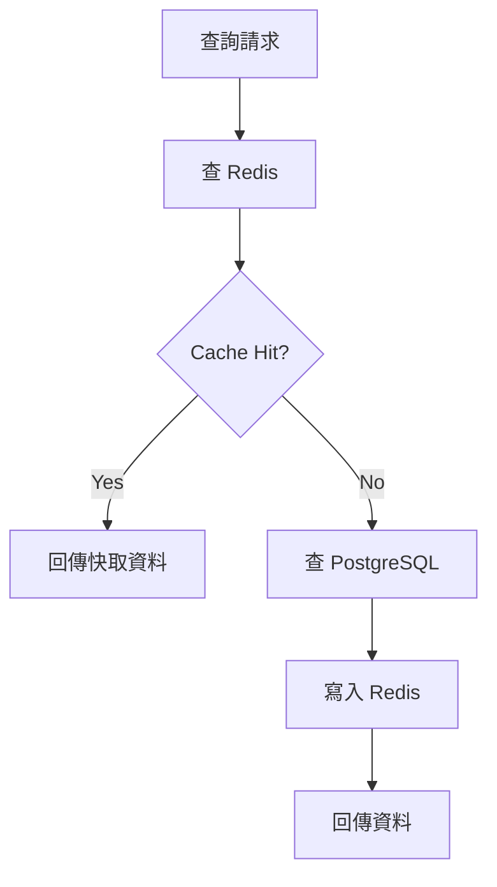
```mermaid
flowchart TD
    A[查詢請求] --> B[查 Redis]
    B --> C{Cache Hit?}
    C -->|Yes| D[回傳快取資料]
    C -->|No| E[查 PostgreSQL]
    E --> F[寫入 Redis]
    F --> G[回傳資料]
```

對應位置：

```txt
backend/src/main/java/com/esun/financialsystem/business/service/impl/FavoriteProductServiceImpl.java
```

---

### 2. Cache Avalanche Prevention：TTL Jitter

如果所有 cache 都設定固定 5 分鐘過期，可能會在同一時間大量失效，導致所有請求瞬間打到資料庫。

因此本系統採用「基礎 TTL + 隨機 TTL」的方式，讓 cache 在不同時間點過期，避免資料庫在某個時間點突然承受大量 cache miss。

```java
long ttlSeconds = 300 + ThreadLocalRandom.current().nextInt(301);
redisTemplate.opsForValue().set(cacheKey, jsonData, ttlSeconds, TimeUnit.SECONDS);
```

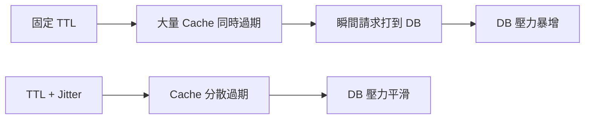
```mermaid
flowchart LR
    A[固定 TTL] --> B[大量 Cache 同時過期]
    B --> C[瞬間請求打到 DB]
    C --> D[DB 壓力暴增]

    E[TTL + Jitter] --> F[Cache 分散過期]
    F --> G[DB 壓力平滑]
```

---

### 3. Idempotency：避免重複提交

使用者可能連續點擊新增按鈕，或因網路延遲重送相同 request。

本系統使用 Redis `SETNX` 實作簡化版冪等性：

```java
String redisIdempotencyKey = resolveIdempotencyKey(request, idempotencyKey);
Boolean success = redisTemplate.opsForValue()
    .setIfAbsent(redisIdempotencyKey, "1", Duration.ofSeconds(10));

if (Boolean.FALSE.equals(success)) {
    throw new BadRequestException("Duplicate request, please try again later");
}
```

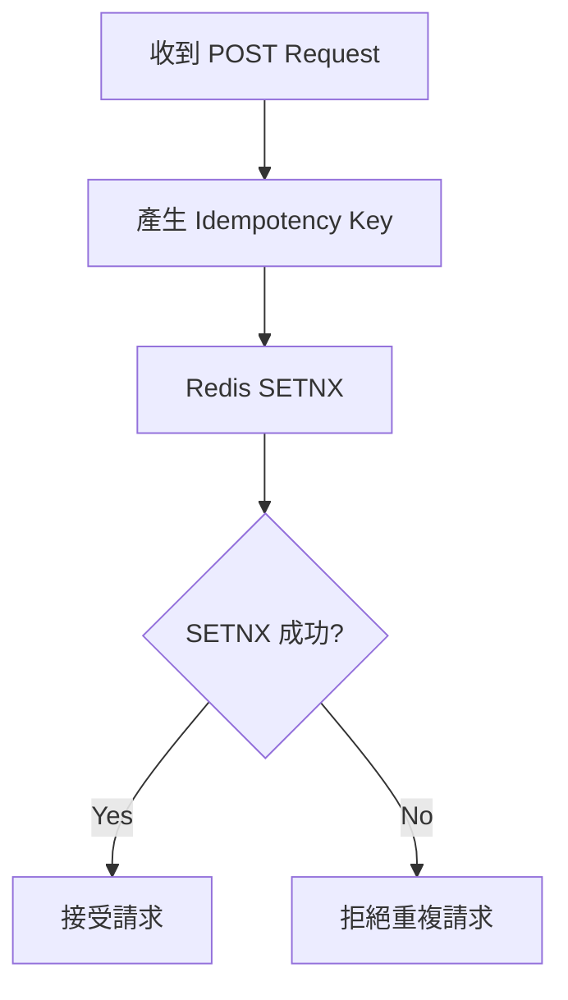
```mermaid
flowchart TD
    A[收到 POST Request] --> B[產生 Idempotency Key]
    B --> C[Redis SETNX]
    C --> D{SETNX 成功?}
    D -->|Yes| E[接受請求]
    D -->|No| F[拒絕重複請求]
```

目前前端會在 mutation request 自動帶入 `Idempotency-Key`，後端會優先使用這個 header 建立 Redis key；若 header 未提供，才以 request 內容產生 fallback key。此設計已可避免短時間重複提交。

若要再接近正式金融系統，可擴充為：

- 儲存 request hash，避免同一 key 被拿去送不同內容
- 儲存 response snapshot
- 支援第一次成功但 response timeout 時的結果重放
- 設計 request 狀態：PROCESSING / SUCCESS / FAILED

---

### 4. PostgreSQL Row Lock：避免 Race Condition

在多個請求同時修改同一筆資料時，可能會發生 Race Condition。

本系統在 Stored Procedure 中使用 `FOR UPDATE` 鎖住資料列：

```sql
PERFORM 1
FROM "User" AS u
WHERE u.user_id = p_user_id
FOR UPDATE;
```

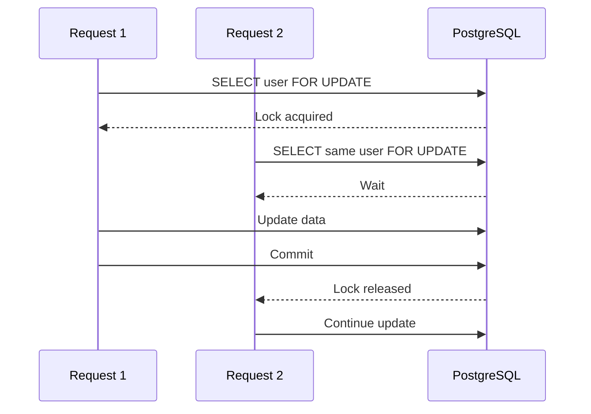
```mermaid
sequenceDiagram
    participant R1 as Request 1
    participant R2 as Request 2
    participant DB as PostgreSQL

    R1->>DB: SELECT user FOR UPDATE
    DB-->>R1: Lock acquired

    R2->>DB: SELECT same user FOR UPDATE
    DB-->>R2: Wait

    R1->>DB: Update data
    R1->>DB: Commit
    DB-->>R2: Lock released

    R2->>DB: Continue update
```

這樣可以確保同一時間只有一個 transaction 能修改相關資料，避免資料不一致。

---

### 5. JSON_AGG：解決 N+1 Query

若使用傳統 ORM 查詢關聯資料，可能會出現：

- 查 User 一次
- 查 LikeList N 次
- 查 Product N 次

這會造成大量 DB round trip。

本系統改由 PostgreSQL 使用 `JSON_AGG` 與 `JSON_BUILD_OBJECT` 一次聚合使用者與喜好商品資料。

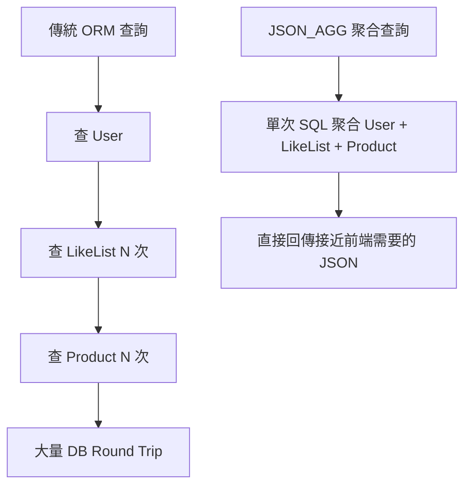
```mermaid
flowchart TD
    A[傳統 ORM 查詢] --> B[查 User]
    B --> C[查 LikeList N 次]
    C --> D[查 Product N 次]
    D --> E[大量 DB Round Trip]

    F[JSON_AGG 聚合查詢] --> G[單次 SQL 聚合 User + LikeList + Product]
    G --> H[直接回傳接近前端需要的 JSON]
```

優點：

- 減少 DB 查詢次數
- 減少後端迴圈組資料
- 回傳格式更接近前端需要的 JSON
- 降低高併發查詢下的 DB 負擔

---

### 6. Kong API Gateway：Rate Limiting 與 Load Balancing

本系統使用 Kong Gateway 作為 API Gateway。所有外部 API 請求會先進入 Kong，再由 Kong 分派到後端服務。

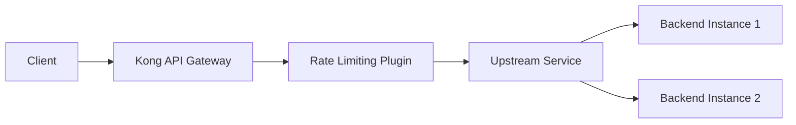
```mermaid
flowchart LR
    Client[Client] --> Kong[Kong API Gateway]
    Kong --> Plugin[Rate Limiting Plugin]
    Plugin --> Upstream[Upstream Service]
    Upstream --> Backend1[Backend Instance 1]
    Upstream --> Backend2[Backend Instance 2]
```

Rate Limiting 設定範例：

```yaml
plugins:
  - name: rate-limiting
    config:
      minute: 120
      policy: local
```

此設計可以在請求進入後端服務之前，先做流量控管，避免單一來源過度消耗系統資源。

---

### 7. Database Indexing：提升查詢效率

本系統針對常見的 WHERE、JOIN、ORDER BY 欄位建立索引。

```sql
CREATE INDEX IF NOT EXISTS idx_like_list_user_id_sn
    ON "LikeList" (user_id, sn);

CREATE INDEX IF NOT EXISTS idx_like_list_product_no
    ON "LikeList" (product_no);

CREATE INDEX IF NOT EXISTS idx_product_price
    ON "Product" (price);
```

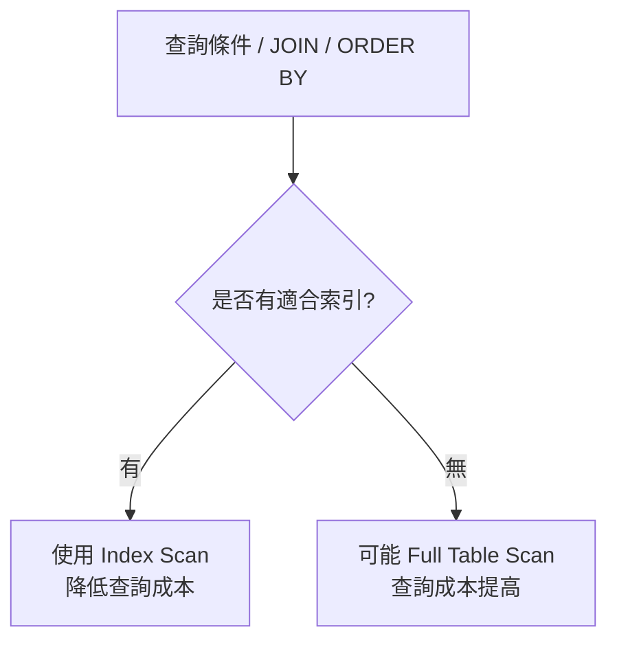
```mermaid
flowchart TD
    A[查詢條件 / JOIN / ORDER BY] --> B{是否有適合索引?}
    B -->|有| C[使用 Index Scan<br/>降低查詢成本]
    B -->|無| D[可能 Full Table Scan<br/>查詢成本提高]
```

索引用途：

| 索引 | 用途 |
|---|---|
| `idx_like_list_user_id_sn` | 加速查詢單一使用者喜好商品並依 sn 排序 |
| `idx_like_list_product_no` | 加速 LikeList 與 Product JOIN |
| `idx_product_price` | 加速價格排序與篩選 |
| `idx_user_email` | 加速 email 查詢 |
| `idx_product_name` | 加速商品名稱查詢 |

---

### 8. Async Queue：削峰填谷

大量寫入請求如果直接進 DB，可能造成資料庫連線與 transaction 壓力暴增。

本系統使用 Redis Queue 暫存寫入任務，並由 Worker 背景消化。

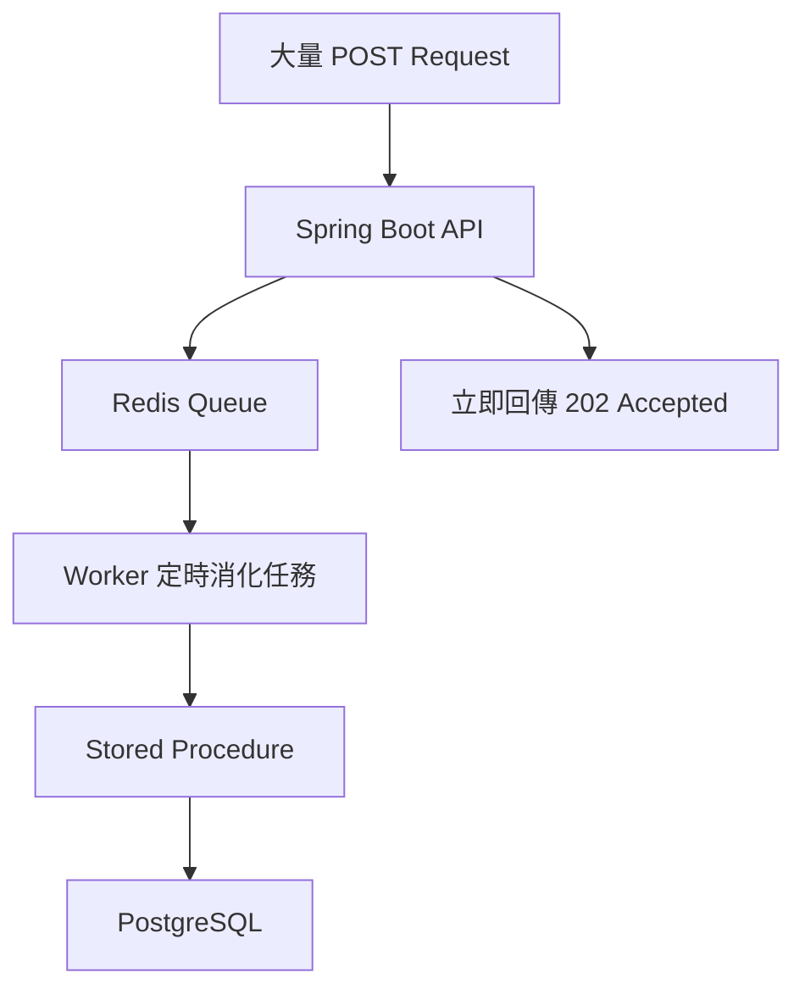
```mermaid
flowchart TD
    A[大量 POST Request] --> B[Spring Boot API]
    B --> C[Redis Queue]
    B --> D[立即回傳 202 Accepted]
    C --> E[Worker 定時消化任務]
    E --> F[Stored Procedure]
    F --> G[PostgreSQL]
```

目前使用 Redis List 作為簡化版 Queue。若要接近 production，可升級為：

- Redis Stream
- RabbitMQ
- Kafka
- Retry mechanism
- Dead Letter Queue
- Message acknowledgement
- Consumer group

---

### 9. Optimistic UI：改善最終一致性體驗

因為新增請求改為非同步處理，API 回傳成功時，資料可能尚未真正寫入 DB。

因此前端使用 Optimistic UI：

1. 使用者送出新增請求。
2. 前端先顯示一筆「處理中」資料。
3. Worker 背景寫入 DB。
4. 前端延遲輪詢最新資料。
5. 正式資料回來後取代暫時資料。

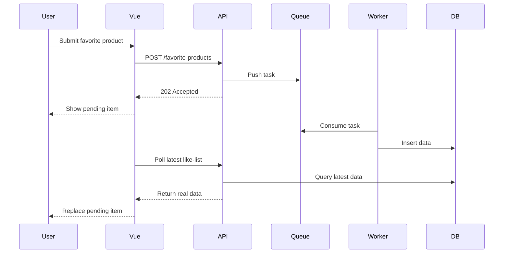
```mermaid
sequenceDiagram
    participant User
    participant Vue
    participant API
    participant Queue
    participant Worker
    participant DB

    User->>Vue: Submit favorite product
    Vue->>API: POST /favorite-products
    API->>Queue: Push task
    API-->>Vue: 202 Accepted
    Vue-->>User: Show pending item

    Worker->>Queue: Consume task
    Worker->>DB: Insert data

    Vue->>API: Poll latest like-list
    API->>DB: Query latest data
    API-->>Vue: Return real data
    Vue-->>User: Replace pending item
```

---

### 10. Pagination：避免大量資料查詢造成負載過高

當資料量成長後，如果 API 一次回傳所有資料，可能造成：

- DB 查詢時間過長
- 後端記憶體壓力增加
- API response 過大
- 前端渲染變慢

因此本系統在查詢清單時加入 Pagination。

```sql
LIMIT COALESCE(NULLIF(p_page_size, 0), 10)
OFFSET GREATEST(COALESCE(p_offset, 0), 0);
```

```mermaid
flowchart TD
    A[大量資料查詢] --> B{是否使用 Pagination?}
    B -->|否| C[一次撈出大量資料]
    C --> D[DB / API / 前端負載增加]

    B -->|是| E[限制 page size]
    E --> F[分批查詢]
    F --> G[降低單次查詢與回應壓力]
```

並搭配總數查詢：

```txt
sp_count_like_list
```

讓前端可以正確顯示總頁數與分頁控制。

---

## 效能壓測結果

本專案使用 Python `aiohttp` 撰寫壓測腳本：

```txt
backend/stress_test.py
```

以下數字為本機 Docker Compose 測試樣本，用來展示優化方向，不代表正式 SLA。  
最後更新壓測時間：2026-05-22。

壓測條件：

| 項目 | 設定 |
|---|---|
| 總請求數 | 1000 |
| 併發數 | 100 |
| 測試環境 | Local Docker Compose |
| 測試 API | localhost:8081 |
| 說明 | 避開 Kong Rate Limiting，單純測試 backend 效能 |
| 寫入測試資料 | 使用 seed 內有效 user / product / account，並為每筆 POST 加唯一 `Idempotency-Key` |

---

### 1. 讀取效能：PostgreSQL vs Redis Cache

| 測試情境 | 吞吐量 RPS | 平均回應時間 | P95 回應時間 |
|---|---:|---:|---:|
| 無快取，直接查 PostgreSQL | 約 1700.93 req/s | 56.39 ms | 126.25 ms |
| 使用 Redis Cache | 約 2706.93 req/s | 35.40 ms | 88.02 ms |

結論：

Redis Cache 讓讀取吞吐量提升約 1.59 倍，平均延遲降低約 37%。  
在高併發查詢場景下，Cache 可以有效降低 PostgreSQL 壓力。

---

### 2. 寫入效能：Async Queue

| 測試情境 | 吞吐量 RPS | 平均回應時間 | P95 回應時間 |
|---|---:|---:|---:|
| Redis Queue 非同步寫入 | 約 3169.83 req/s | 29.81 ms | 52.46 ms |

結論：

API 僅負責驗證請求與推入 Redis Queue，因此可以快速回應。  
真正的 DB 寫入由 Worker 背景處理，達成削峰填谷效果。本次壓測後確認 Redis queue 回到 0，且 1000 筆有效任務皆已由 Worker 寫入資料庫；測試完成後已清除壓測新增資料。

---

## 專案結構

```txt
.
├── backend/
│   ├── src/main/java/com/esun/financialsystem/
│   │   ├── presentation/         # Controller、Request、Response
│   │   ├── business/             # Service、Business Logic、Worker
│   │   ├── data/                 # Repository、DB Access
│   │   └── common/               # Exception、共用工具
│   ├── src/main/resources/
│   │   └── application.yml
│   ├── Dockerfile
│   └── pom.xml
│
├── frontend/
│   ├── src/
│   │   ├── App.vue
│   │   ├── api.js
│   │   ├── style.css
│   │   └── components/
│   │       ├── FavoritePanel.vue
│   │       ├── UserPanel.vue
│   │       └── ProductPanel.vue
│   ├── nginx.conf
│   ├── Dockerfile
│   └── package.json
│
├── db/
│   ├── 01_schema.sql
│   ├── 02_seed.sql
│   ├── 03_procedures.sql
│   └── 04_indexes.sql
│
├── gateway/
│   └── kong.yml
│
├── .github/
│   └── workflows/
│       └── ci.yml
│
└── docker-compose.yml
```

---

## 技術棧

| 層級 | 技術 |
|---|---|
| 前端 | Vue 3、Vite、Axios |
| Web Server | Nginx 1.27 |
| API Gateway | Kong Gateway DB-less mode |
| 後端 | Java 17、Spring Boot 3、Spring Web、Spring JDBC、Spring Data Redis |
| 資料庫 | PostgreSQL 16 |
| Cache / Queue | Redis 7 |
| 容器化 | Docker、Docker Compose |
| CI | GitHub Actions |
| 系統設計 | Cache Aside、Idempotency、Rate Limiting、Async Queue、Optimistic UI |

---

## CI 持續整合

本專案配置 GitHub Actions 作為自動化 CI 流程：

```txt
.github/workflows/ci.yml
```

CI 會在 Push 或 Pull Request 到 `main` 與 `dev` 分支時自動執行。

檢查內容包含：

| 階段 | 說明 |
|---|---|
| Backend Tests | 建立 Java 17 環境，執行 `mvn test` |
| Frontend Tests / Build | 建立 Node 22 環境，執行 `npm run test` 與 `npm run build` |
| Docker Compose Config | 驗證 `docker-compose.yml` 語法與服務設定 |

```mermaid
flowchart LR
    A[Push / Pull Request] --> B[GitHub Actions]
    B --> C[Backend Maven Test]
    B --> D[Frontend Test and Build]
    B --> E[Docker Compose Config Check]
    C --> F{All Pass?}
    D --> F
    E --> F
    F -->|Yes| G[Ready to Merge]
    F -->|No| H[Block and Fix]
```

CI 的目的：

- 避免改 A 壞 B
- 確保後端測試通過
- 確保前端可正常 build
- 確保 Docker Compose 設定正確
- 提升專案穩定性與可維護性

---

## 開發與啟動方式

### 方式一：Docker Compose 全套啟動

```sh
docker compose up -d --build
```

啟動後服務如下：

| 服務 | URL / Port |
|---|---|
| 前端 Nginx | http://localhost:3000 |
| Kong API Gateway | http://localhost:8000 |
| Backend API 1 | http://localhost:8081 |
| Backend API 2 | http://localhost:8082 |
| PostgreSQL | localhost:5432 |
| Redis | localhost:6380 |

查看容器狀態：

```sh
docker compose ps
```

查看 logs：

```sh
docker compose logs -f
```

停止服務：

```sh
docker compose down
```

---

### 方式二：本機前端開發模式

```sh
docker compose up -d postgres redis backend kong

cd frontend
npm install
npm run dev
```

前端 dev server：

```txt
http://localhost:5173
```

---

## Redis Dashboard 檢查方式

若要確認 Redis 是否真的有存入 cache、queue 或 idempotency key，可以使用 RedisInsight。

因為本專案 Docker Redis 對外 port 為 `6380`，RedisInsight 連線設定如下：

| 欄位 | 值 |
|---|---|
| Host | 127.0.0.1 |
| Port | 6380 |
| Name | esun-local-redis |

CLI 檢查方式：

```sh
redis-cli -p 6380
```

查看所有 key：

```sh
keys *
```

查看 queue 長度：

```sh
llen queue:favorite_products
```

---

## API 快速導覽

API Gateway Base URL：

```txt
http://localhost:8000
```

### Favorite Product API

| Method | Endpoint | 說明 |
|---|---|---|
| GET | `/api/favorite-products/like-list` | 查詢所有使用者喜好清單 |
| GET | `/api/favorite-products/users/{userId}` | 查詢單一使用者喜好商品，具備 Redis Cache |
| POST | `/api/favorite-products` | 新增喜好商品，具備 Idempotency 與 Async Queue |
| PUT | `/api/favorite-products/{sn}` | 修改喜好商品，成功後清除 cache |
| DELETE | `/api/favorite-products/{sn}` | 刪除喜好商品，成功後清除 cache |

### User API

| Method | Endpoint | 說明 |
|---|---|---|
| GET | `/api/users` | 查詢使用者清單 |
| GET | `/api/users/{userId}` | 查詢單一使用者 |
| POST | `/api/users` | 新增使用者 |
| PUT | `/api/users/{userId}` | 修改使用者 |
| DELETE | `/api/users/{userId}` | 刪除使用者 |

### Product API

| Method | Endpoint | 說明 |
|---|---|---|
| GET | `/api/products` | 查詢商品清單 |
| GET | `/api/products/{no}` | 查詢單一商品 |
| POST | `/api/products` | 新增商品 |
| PUT | `/api/products/{no}` | 修改商品 |
| DELETE | `/api/products/{no}` | 刪除商品 |

---

## 專案定位

本專案不是單純的 CRUD Demo，而是以銀行金融商品喜好紀錄系統為核心，延伸實作常見後端系統設計議題：

- 高併發讀取如何保護 DB
- 重複提交如何避免
- 多請求同時修改資料如何保持一致性
- ORM 常見 N+1 問題如何優化
- API Gateway 如何限流與保護後端
- 非同步寫入如何削峰填谷
- 最終一致性如何透過前端體驗補償
- CI 如何避免程式碼變更破壞既有功能

因此本專案同時具備：

- 實作題完整性
- 後端分層架構
- 資料庫交易設計
- 系統設計教學價值
- 工程化與 CI/CD 思維
